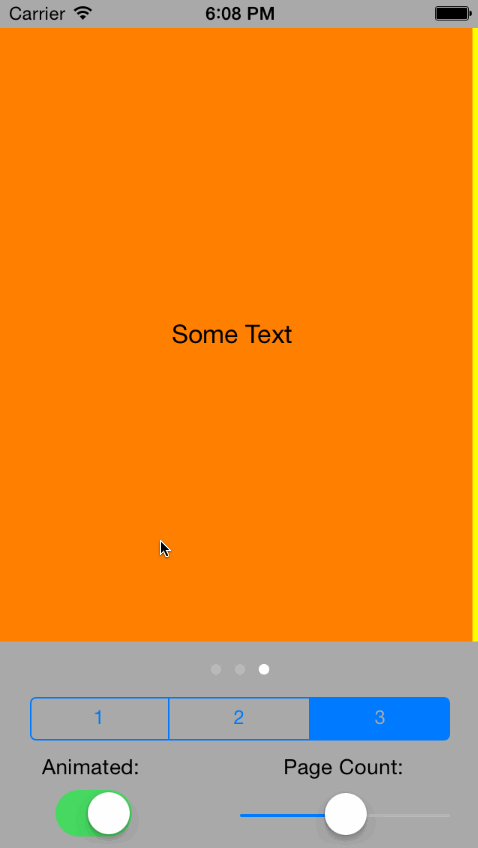

GRKPageViewController
===========
A container UIViewController providing paginated scrolling between configured view
controllers. Similar to UIPageViewController, but with added control and feedback.

#### Future Ideas

* Vertical paging support.
* Spacing between view controllers

### Installing

If you're using [CocoPods](http://cocopods.org) it's as simple as adding this to your `Podfile`:

	pod 'GRKPageViewController'

otherwise, simply add `GRKPageViewController.h` and `GRKPageViewController.m` to your
project.

### Documentation

`GRKPageViewController` follows the familiar data source and delegate pattern. To
configure, register your object as the data source and optionally register your object as 
the delegate.

Your data source (`GRKPageViewControllerDataSource`) must implement:

	- (NSUInteger)pageCountForPageViewController:(GRKPageViewController *)controller;
	- (UIViewController *)viewControllerForIndex:(NSUInteger)index forPageViewController:(GRKPageViewController *)controller;
	
to specify the number of pages and provide the corresponding view controller objects.

Optionally your delegate (`GRKPageViewControllerDelegate`) can implement either of the
following to get feedback about index changes:

	- (void)changedIndexOffset:(CGFloat)indexOffset forPageViewController:(GRKPageViewController *)controller;
	- (void)changedIndex:(NSUInteger)index forPageViewController:(GRKPageViewController *)controller;

Additional documentation is available in `GRKPageViewController.h` and example usage can
be found in the GRKPageViewControllerTestApp source.

#### Disclaimer and Licence

* This work makes use of WWDC 2010 PagingScrollView sample code provided by [Apple](https://developer.apple.com/wwdc/resources/)
* This work is licensed under the [Creative Commons Attribution 3.0 Unported License](http://creativecommons.org/licenses/by/3.0/).
  Please see the included LICENSE.txt for complete details.

#### About
A professional iOS engineer by day, my name is Levi Brown. Authoring a technical blog
[grokin.gs](http://grokin.gs), I am reachable via:

Twitter [@levigroker](https://twitter.com/levigroker)  
App.net [@levigroker](https://alpha.app.net/levigroker)  
Email [levigroker@gmail.com](mailto:levigroker@gmail.com)  

Your constructive comments and feedback are always welcome.
